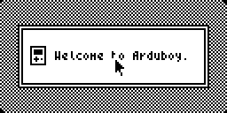

# Ardutosh

Ardutosh is an OS / desktop environment for the [Arduboy miniature game system](https://www.arduboy.com) made for the Arduboy game jam 4 where the theme was 'not a game'.

The style is inspired by the classic Macintosh interface.

## Build instructions
To compile from source you will need the [Arduboy2 library](https://github.com/MLXXXp/Arduboy2) and the Arduino IDE

Open /Source/Ardutosh/Ardutosh.ino in the Arduino IDE and hit build

## Flashing other games
Note that there is a bug with the Arduboy bootloader when flashing new games. If flashing a new Arduino sketch after having previously flashing Ardutosh, then first boot the Arduboy into *flashlight mode* by holding the up button whilst switching on the device.
